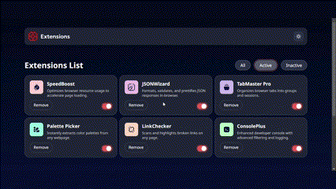
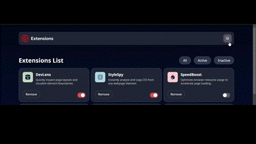

## Browser Extensions Manager 🌐🔧

Un administrador de extensiones de navegador construido con React que permite:

✅ Ver todas tus extensiones
✅ Filtrar por estado (Activas/Inactivas)
✅ Alternar entre activar/desactivar extensiones
✅ Eliminar extensiones con confirmación

## 📦 Características

1. Listado de Extensiones
Muestra todas las extensiones con su logo, nombre y descripción.

Diseño responsive con CSS moderno.

2. Filtrado Inteligente
Todos: Muestra todas las extensiones.

Activas: Solo extensiones habilitadas (isActive: true).

Inactivas: Solo extensiones deshabilitadas (isActive: false).

3. Gestión de Estado
Toggle Switch: Activa/desactiva extensiones con un interruptor visual.

Eliminar Extensiones: Con modal de confirmación para evitar borrados accidentales.

4. Tema Claro/Oscuro
Cambia entre modo claro y oscuro (implementado en Header.jsx).

## 🛠️ Tecnologías Usadas

✅React 19 (con Hooks: useState, useEffect)

✅Vite (entorno de desarrollo rápido)

✅CSS Modules (para estilos encapsulados)

✅Jest + Testing Library (para pruebas unitarias)

## 🚀 Cómo Ejecutar el Proyecto

1. Instalación
```bash
git clone https://github.com/joselmuziotti/01-browser-extension.git
cd 01-browser-extension
npm install
```

2. Ejecutar en Desarrollo
```bash
npm run dev
Abre http://localhost:5173 en tu navegador.
```

3. Build para Producción
```bash
npm run build
(Genera archivos optimizados en /dist).
```

4. Ejecutar Tests
```bash
npm test           # Ejecuta todos los tests
npm run test:watch # Modo observación (ideal para desarrollo)
```

## 📂 Estructura del Proyecto

src/  
├── components/  
│   ├── card/            # Componente de tarjeta de extensión  
│   ├── filter-bar/      # Barra de filtrado (All/Active/Inactive)  
│   ├── header/          # Tema claro/oscuro  
│   └── modal/           # Modal de confirmación (opcional)  
├── js/  
│   └── data.json        # Datos de ejemplo de extensiones  
└── App.jsx              # Componente principal

## 🎨 Componentes Principales

```jsx
// Ejemplo de Card.jsx
const Card = ({ name, logo, description, isActive, onRemove }) => (
  <div className="card">
    
    <h3>{name}</h3>
    <p>{description}</p>
    <button onClick={() => onRemove(name)}>Remove</button>
    <ToggleSwitch isActive={isActive} />
  </div>
);
```

## 🎨 Ejemplos de Uso

1. Filtrado


2. Eliminar con Confirmación



3. Alternar Estado


4. Temas Oscuro y Claro



## 💡 Sugerencias para Mejorar

# 1. Persistencia de Datos
Guardar el estado en localStorage para que no se pierdan los cambios al recargar.

Ejemplo:

```javascript
Copy
useEffect(() => {
  localStorage.setItem('extensions', JSON.stringify(extensions));
}, [extensions]);
```
# 2. Animaciones
Añadir transiciones al eliminar/mostrar tarjetas con CSS Transitions o Framer Motion.

# 3. Búsqueda por Nombre
Agregar un input para filtrar extensiones por nombre.

# 4. Undo al Eliminar
Implementar un snackbar con "Deshacer" al borrar una extensión.

## gustó el proyecto? ¡Déjale una ⭐ en GitHub!

# 🔹 Nota: Este proyecto es ideal para practicar gestión de estado en React, componentes reutilizables y buenas prácticas de UI.

# 🔹 ¿Preguntas? ¡Abre un issue o contribuye con un PR! 🚀

# Happy Coding! 👨‍💻👩‍💻